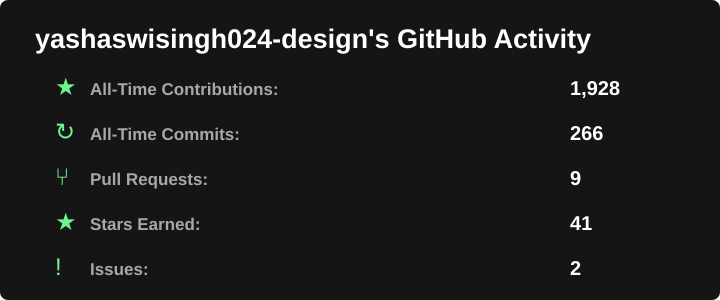

# 👋 Hi, I'm Yashaswi Singh

🎓 B.E. Computer Engineering Student  
💻 Exploring Software Development, AI & Data Structures  
🚀 Building real-world projects and participating in hackathons  
🌱 Currently learning DSA, Full-Stack Development & AI  
📍 India

---

## 🚀 About Me

I'm a Computer Engineering student passionate about building practical technology solutions.

- 🔭 Building AI-powered and full-stack projects
- 🧠 Learning Data Structures & Algorithms
- 🤖 Exploring Generative AI and applied AI
- 🌐 Building responsive web applications

---

## 💻 Tech Stack

### Languages

### Web Development

### Data & AI

### Tools & Cloud

---

## 🌟 Featured Projects

### 🤖 JanSetu AI
AI-powered civic complaint platform that simplifies grievance reporting, classification and routing.

### 🛣️ RoadSetu AI
Smart road and pothole reporting platform with AI-powered analysis, location-based reporting and accountability tracking.

### 🎓 CampusLoop
AI-powered student marketplace for buying, selling, swapping and renting within college communities.

### 🗣️ BhashaMitra AI
Voice-first multilingual learning platform designed to make primary education more accessible in regional languages.

---

## 📊 GitHub Activity

<table>
<tr>
<td width="50%" align="center">

</td>

<td width="50%" align="center">

</td>
</tr>
</table>

---
## 📊 Contribution Activity

## 🌐 Connect With Me

---

<!-- Snake Animation --> 
  
 

⭐️ Thanks for visiting my profile!

